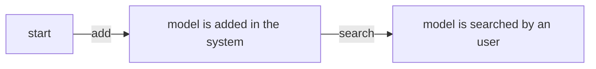

Today, we are about to learn a new programming language.
We will spend an hour reviewing keywords, loops, and variance...
And if we have time left, we...

_Wait!_ This is wrong. Why would a software engineer
with 5y+ of experience suffer again learning all the basics??

Scratch all that. Instead of starting with the basics,
we will be starting with clean architecture, DDD, and then we dive
deeper into how to implement domain, ports, and how to deploy all this.

Let's apply this to python.

<!-- more -->

# Pre-requisites

- **A good understanding of clean architecture**. One really good read I suggest
  is [Herberto Graça variant of clean architecture](https://herbertograca.com/2017/11/16/explicit-architecture-01-ddd-hexagonal-onion-clean-cqrs-how-i-put-it-all-together/)

- **A good understanding of event storming**. You will see plenty of tutorial around, like [this one](https://contextmapper.org/docs/event-storming/).
  make sure what you use is visual.

- **No python knowledge is required**. It's ok if you do not understand it all. You can look at the documentation on the go

Let's practice this in this example

> With so much ML models around, users want to discover, tests, and share them. Let's make an app for this

## Event-storming ideas

Let's start with this:

> As a user, I want to know what models are nice for my use-case



# User interface

For your application to handle use cases, it needs to react to user (or consumer system) input.

Always remember, your language is compiled for/interpreted in an ecosystem. Some user interfaces will
be therefore better suited than others

Be careful with user interface libraries. Python support of async was added "recently".
Most libraries are not letting you await I/Os operations,
meaning you could block your CPU.

## CLI

The easiest way to have user inputs is via a command line interface. Easy to develop, can be integrated
into shell scripts

### Arguments

Using [argparse](https://docs.python.org/fr/3/library/argparse.html) lib, you can read from command line. There are zsh/bash [plugins](https://github.com/kislyuk/argcomplete) to make it seamlessly integrated with your fav shell
You can use subcommands per use-case

```python
import argparse
import sys


# We will define that later
def add_model(name: str, tags: list[str]):
    print("model", name, "added with tags ", tags)


def search_model(tags: list[str]):
    print("searching for tags", tags)


parser = argparse.ArgumentParser()

subparsers = parser.add_subparsers(dest="command", help="subcommand help")

add_model_command = subparsers.add_parser("addmodel", help="Add a model")
search_model_command = subparsers.add_parser("search", help="Search for a model")


add_model_command.add_argument("model", type=str, help="name of the model")
add_model_command.add_argument("tags", type=str, help="tags", nargs="+")
search_model_command.add_argument("tags", type=str, help="tags", nargs="+")


opts = parser.parse_args(sys.argv[1:])

if opts.command == "addmodel":
    add_model(opts.model, opts.tags)
elif opts.command == "search":
    search_model(opts.tags)
```

### I/O

Check `input` and `print` from [functions](https://docs.python.org/3/library/functions.html)

## API

Often, you create a module that is imported by another module.
In this case, you have a programmatic interface.

This is especially the case if your script runs inside a [Jupyter notebook](https://jupyter.org/) or [google collab project](https://colab.research.google.com/)
In such case, make sure to expose entry functions in your python project

First step is to create your function dedicated for API.
They may import in return, other stuff from your domain or infra (ex: aggregate roots, ports..)

Create a `api/add_model.py` file

```python title="api/add_model.py"
def add_model(name: str, tags: list[str]):
    print("model", name, "added with tags ", tags)
```

Once you have this, create an `api/__init__.py` file to create a module. This construction will make your consumer unaware of which files reside your
implementations

```python title="api/__init__.py"
# __all__ allows someone to to import wildcard directives
__all__ = ['add_model', 'search_model']

from .add_model import add_model
from .search_model import search_model
```

> the dot here is used to say "we are importing from the module of this directory"

After this, you will be able to import your method

```python
from api import add_model
```

Follow [packaging projects](https://packaging.python.org/en/latest/tutorials/packaging-projects/) if you want to then publish your package

## Web

To make your app web-ready, you need to wire it up to controllers. As in the js world, you have plenty of libraries:

| Type of lib            | Lib                                         | Js equivalent                          |
| ---------------------- | ------------------------------------------- | -------------------------------------- |
| Opinionated framework  | [django](https://www.djangoproject.com/)    | [nestjs](https://nestjs.com/)          |
| Lightweight framework  | [fastapi](https://fastapi.tiangolo.com/)    | [fastify](https://fastify.dev/)        |
| Lightweight simple lib | [flask](https://flask.palletsprojects.com/) | [expressjs](https://expressjs.com/fr/) |

For this blog post, we are going to use `fastapi`

Following the [documentation](https://fastapi.tiangolo.com/tutorial/first-steps/), create a `main.py` file and add the endpoints

```python title=main.py file
from fastapi import FastAPI
from pydantic import BaseModel

# Import your domain
from domain import MlModels


# Assemble your aggregate roots
ml_models = MlModels()


# Define some HTML DTOs using pydantic.BaseModel
class MlModelRequestBody(BaseModel):
    name: str
    tags: list[str]

# Create a fast api app
app = FastAPI()

# Execute methods on your agregate roots
@app.post("/models", status_code=201)
def addModel(model: MlModelRequestBody):
    ml_models.add_model(model.name, model.tags)
    return
```

# Infrastructure

For your application to work, it needs an infrastructure. We're going to simply quote a few libraries here.
Like with user interface libraries, keep in mind that some of them do not handle async/await, therefore, they will
waste your CPU resources.

| Usual use-case        | Lib                                                                                                                                       |
| --------------------- | ----------------------------------------------------------------------------------------------------------------------------------------- |
| Distributed kvm,cache | [Redis](https://redis-py.readthedocs.io/en/stable/examples/asyncio_examples.html)                                                         |
| Distributed pub/sub   | [RabbitMq](https://www.rabbitmq.com/tutorials/tutorial-one-python), maybe [kafka-python-ng](https://github.com/wbarnha/kafka-python-ng) ? |
| NoSQL                 | [MongoDB](https://motor.readthedocs.io/en/stable/)                                                                                        |
| Sql                   | [PostgreSQL](https://github.com/MagicStack/asyncpg)                                                                                       |
| ORM                   | [SQLAlchemy](https://docs.sqlalchemy.org/en/20/tutorial/)                                                                                 |

Let's implement a NoSQL because it's in vogue (no, let's not discuss the CAP theorem here!)

As usual, start defining your infrastructure DTOs and contracts.
In your project, you may want to use an ORM to handle all this. Let's do it by hand for now.

```python title='infrastructure/models_repository.py'
from dataclasses import dataclass, abstractmethod
import json

# This creates a DTO
@dataclass
class MlModelItem:
    name: str
    tags: list[str]

    def to_json(self):
        return json.dumps(self.__dict__, default=lambda x: x.__dict__, indent=4)

    @staticmethod
    def from_json(jsonStr: str):
        jsonObject = json.loads(jsonStr)
        return MlModelItem(name=jsonObject["name"], tags=jsonObject["tags"])

# Abstract class
# yes, ABC means abstract class.
from abc import ABC
from typing import Awaitable

class MlModelRepository(ABC):
    @abstractmethod
    def add(self, item: MlModelItem) -> Awaitable[None]:
        pass

    @abstractmethod
    def list(self) -> Awaitable[list[MlModelItem]]:
        pass
```

Port your infrastructure for MongoDB

```python title='ports/mongodb_port.py'


import motor.motor_asyncio


class MongoDbMlModelRepository(MlModelRepository):
    def __init__(
        self,
    ) -> None:
        super().__init__()
        self.client = motor.motor_asyncio.AsyncIOMotorClient("localhost", 27017)
        self.db = self.client.get_database("modelsapp")
        self.models = self.db.get_collection("models")

    def close(self):
        self.client.close()

    async def add(self, item: MlModelItem) -> Awaitable[None]:
        await self.models.insert_one(json.loads(item.to_json()))

    async def list(self) -> Awaitable[list[MlModelItem]]:
        result = []
        cursor = self.models.find()
        for document in await cursor.to_list(length=100):
            result.append(MlModelItem(name=document["name"], tags=document["tags"]))
        return result

# Important: register the concrete class as
# implementing the parent class
MlModelRepository.register(MongoDbMlModelRepository)
```

and use your repository in your app in your app

```python
    ml_model_repository =  MongoDbMlModelRepository()
    ml_aggregate_root = MlModels(ml_model_repository)
```

# Domain layer

Yes. This is supposed to be a DDD-centric tutorial, and we're finishing with the domain.

At this point in the document, I expect you, the reader, to have at least vague notions
of how to do inversion of control using abstractions, you should also be able to write your own DTOS.

You should already have also an idea about how to write your aggregates (root or not).

So, what's missing to do a good domain layer?

You tell me!

# DevOps and Dev experience

Once you have an idea of how to create a solution that fits your needs, you will need
to put it in a development and deployment cycle.

## OOP or FP?

Some languages are more suited to model objects than model functions.
However, keep in mind that python still allow you to do some sort of
[functional programming](https://docs.python.org/3/howto/functional.html)

Functional Programming is well adapted when you handle data flows, or express
an intent to describe a function rather than a concept.

## How to do unit tests

[Pytest](https://docs.pytest.org/en/8.2.x/) is a good tool to do unit tests.

1. Install it `pip install pytest`
2. create a file named `test_something.py` or `something_test.py`. Coming from the web `file.spec.ts`,
   I like the 2d option more.
3. Create a method prefixed by test. ex: `test_should_close_db_after_use`

## Package management

| Use case                    | In python                               | If you come from web                 |
| --------------------------- | --------------------------------------- | ------------------------------------ |
| Platform Version management | [pyenv](https://github.com/pyenv/pyenv) | [nvm](https://github.com/nvm-sh/nvm) |
| Project Package management  | [Poetry](https://python-poetry.org/)    | [npm](https://www.npmjs.com/)        |
| Global Package management   | [pip](https://pip.pypa.io/en/stable/)   | [npm -g](https://www.npmjs.com/)     |

# Good reads

- [LATO](https://lato.readthedocs.io/en/latest/key_concepts/dependency_injection.html) to do Dep injection and loosely coupling
- [Python DDD](https://github.com/pgorecki/python-ddd/blob/main/src/modules/catalog/application/__init__.py) a good repo to start from
- [python-ddd-example](https://github.com/jparadadev/python-ddd-example/tree/main/src/contexts/shared/domain)
